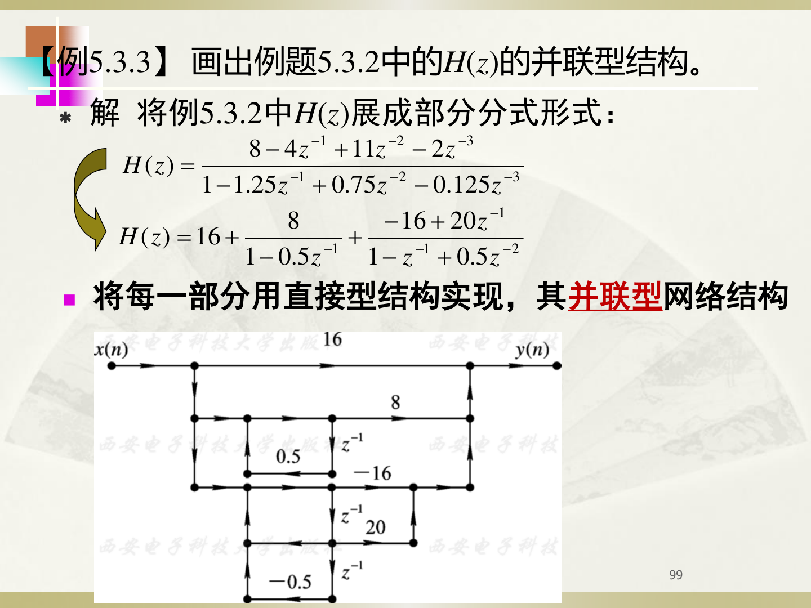

# IIR 系统的网络结构

## 【通俗理解】

你已经学过系统函数 $H(z)$ 和差分方程。但这些都是"纸上公式"。要真正用硬件或程序**实现**一个系统，你需要把公式变成一张"电路图"——这就是网络结构图。

这张图只用**三种零件**拼起来，就像搭积木一样。

---

## 准备知识：三种零件从哪来？

差分方程里只有三种操作：**延迟**（$y(n-1)$ 延迟一拍）、**乘常数**（乘以系数）、**加法**（把所有项加起来）。

所以在结构图中：

| 零件 | 图中符号 | 对应差分方程中的什么 | 大白话 |
|------|---------|-------------------|--------|
| **单位延迟器** | $z^{-1}$ | $y(n-1)$、$x(n-1)$ 中的"$-1$" | 一个寄存器，把上一拍的值记住，下一拍再拿出来用 |
| **常数乘法器** | 标有系数的箭头 | 差分方程中的乘积系数（如 $5/4$、$-4$ 等） | 把信号放大或缩小相应的倍数 |
| **加法器** | ⊕ 或黑点连线汇总 | 差分方程中的"$+$"号 | 把多路信号加在一起 |

---

## 一、直接型（Direct Form）

直接型就是直接根据差分方程的系数来画图。最常用的结构是**直接 II 型**（共享延迟器结构），它可以用最少的延迟器实现系统。

### 【例5.3.1】（复习PPT第97页原题）

**题目**：设 IIR 数字滤波器的系统函数 $H(z)$ 为：

$$
H(z) = \frac{8 - 4z^{-1} + 11z^{-2} - 2z^{-3}}{1 - \frac{5}{4}z^{-1} + \frac{3}{4}z^{-2} - \frac{1}{8}z^{-3}}
$$

画出该滤波器的直接型结构。

### 【手把手解析过程】

#### 第1步：写出差分方程并整理

系统函数 $H(z) = \frac{Y(z)}{X(z)}$，交叉相乘：

$$
Y(z)\left(1 - \frac{5}{4}z^{-1} + \frac{3}{4}z^{-2} - \frac{1}{8}z^{-3}\right) = X(z)\left(8 - 4z^{-1} + 11z^{-2} - 2z^{-3}\right)
$$

取逆 Z 变换（$z^{-k}$ 对应延迟 $k$ 步）：

$$
y(n) - \frac{5}{4}y(n-1) + \frac{3}{4}y(n-2) - \frac{1}{8}y(n-3) = 8x(n) - 4x(n-1) + 11x(n-2) - 2x(n-3)
$$

整理成 $y(n) = \ldots$ 的形式：

$$
y(n) = \underbrace{\frac{5}{4}y(n-1) - \frac{3}{4}y(n-2) + \frac{1}{8}y(n-3)}_{\text{反馈部分（来自母多项式）}} + \underbrace{8x(n) - 4x(n-1) + 11x(n-2) - 2x(n-3)}_{\text{前馈部分（来自分子多项式）}}
$$

#### 第2步：识别反馈与前馈系数

- **分母（反馈系数 $a_k$）**：注意差分方程移项后，**反馈系数的符号发生了改变（负变正，正变负）**！
  - $a_1 = -\frac{5}{4} \implies$ 移项后为 **$5/4$**（图左侧第1个乘法器）
  - $a_2 = +\frac{3}{4} \implies$ 移项后为 **$-3/4$**（图左侧第2个乘法器）
  - $a_3 = -\frac{1}{8} \implies$ 移项后为 **$1/8$**（图左侧第3个乘法器）
- **分子（前馈系数 $b_k$）**：保持原符号不变！
  - $b_0 = \mathbf{8}$（图右侧最上方直通支路）
  - $b_1 = \mathbf{-4}$（图右侧第1个乘法器）
  - $b_2 = \mathbf{11}$（图右侧第2个乘法器）
  - $b_3 = \mathbf{-2}$（图右侧第3个乘法器）

#### 第3步：对照 P97 结构图理解连线

打开 `图片/P97_例5.3.1_直接型.png`：
- **中间那根竖线和 3 个 $z^{-1}$ 方框**：这就是延迟器链。输入信号 $x(n)$ 进入系统后，在中间这根轴上依次向下延迟：
  - 经过第 1 个 $z^{-1}$ 产生 $w(n-1)$
  - 经过第 2 个 $z^{-1}$ 产生 $w(n-2)$
  - 经过第 3 个 $z^{-1}$ 产生 $w(n-3)$
- **左边一列箭头（反馈回路）**：
  - 从第1个延迟器输出向左拉，乘以 **$5/4$**，加回输入端
  - 从第2个延迟器输出向左拉，乘以 **$-3/4$**，加回输入端
  - 从第3个延迟器输出向左拉，乘以 **$1/8$**，加回输入端
- **右边一列箭头（前馈通路）**：
  - 最上面直通支路，乘以 **$8$**
  - 从第1个延迟器输出向右拉，乘以 **$-4$**，加到输出端
  - 从第2个延迟器输出向右拉，乘以 **$11$**，加到输出端
  - 从第3个延迟器输出向右拉，乘以 **$-2$**，加到输出端
- **最右边向上指的箭头和黑点**：表示将这些前馈乘积加在一起，最终输出 $y(n)$。

---

## 二、级联型 —— 分解成小段串联

### 例5.3.2（复习PPT第98页）

**题目**：已知系统函数如下式，试画出其级联型网络结构。

$$
H(z) = \frac{8 - 4z^{-1} + 11z^{-2} - 2z^{-3}}{1 - 1.25z^{-1} + 0.75z^{-2} - 0.125z^{-3}}
$$

**标准答案求解过程**：

**第1步：对分子、分母多项式分别进行因式分解**

将分子分解为一个一阶因子和一个二阶因子：

$$
8 - 4z^{-1} + 11z^{-2} - 2z^{-3} = (2 - 0.379z^{-1})(4 - 1.24z^{-1} + 5.264z^{-2})
$$

将分母分解为一个一阶因子和一个二阶因子：

$$
1 - 1.25z^{-1} + 0.75z^{-2} - 0.125z^{-3} = (1 - 0.25z^{-1})(1 - z^{-1} + 0.5z^{-2})
$$

得到组合后的系统函数：

$$
H(z) = \underbrace{\frac{2 - 0.379z^{-1}}{1 - 0.25z^{-1}}}_{\text{一阶子系统 }H_1(z)} \cdot \underbrace{\frac{4 - 1.24z^{-1} + 5.264z^{-2}}{1 - z^{-1} + 0.5z^{-2}}}_{\text{二阶子系统 }H_2(z)}
$$

**第2步：对照 P98 结构图理解连线**

打开 `图片/P98_例5.3.2_级联型.png`。级联型就是将这两个子系统**首尾串联**：

1. **左边的一阶网络 $H_1(z)$**：
   - 只需要 **1 个延迟器 $z^{-1}$**
   - 分母反馈系数：移项后为 **$0.25$**（左侧向上的箭头）
   - 分子前馈系数：直通为 **$2$**，延迟抽头为 **$-0.379$**（右侧向上的箭头）
2. **右边的二阶网络 $H_2(z)$**：
   - 需要 **2 个延迟器 $z^{-1}$**
   - 分母反馈系数：$a_1 = -1 \implies$ 移项后为 **$1$**；$a_2 = 0.5 \implies$ 移项后为 **$-0.5$**
   - 分子前馈系数：直通为 **$4$**，第1个延迟抽头为 **$-1.24$**，第2个延迟抽头为 **$5.264$**
3. **连接方式**：输入 $x(n)$ 进入一阶网络，一阶网络的输出作为二阶网络的输入，最后从二阶网络输出 $y(n)$。

---

## 三、并联型 —— 展开后分路并联

### 例5.3.3（复习PPT第99页）

**题目**：画出例题5.3.2中 $H(z)$ 的并联型结构。

**标准答案求解过程**：

**第1步：将 $H(z)$ 展开为部分分式形式**

利用第2章的部分分式展开法，将三阶有理分式展开成常数项、一阶分式和二阶分式的和：

$$
H(z) = \underbrace{16}_{\text{常数项 } C} + \underbrace{\frac{8}{1-0.5z^{-1}}}_{\text{一阶子系统 } H_1(z)} + \underbrace{\frac{-16+20z^{-1}}{1-z^{-1}+0.5z^{-2}}}_{\text{二阶子系统 } H_2(z)}
$$

**第2步：对照 P99 结构图理解连线**

打开 `图片/P99_例5.3.3_并联型.png`。并联型就是各子系统**并行接收输入，输出相加**：

1. **最上方的直通路**：只有一个常数乘法器 **$16$**。
2. **中间的一阶网络 $H_1(z)$**：
   - 1 个延迟器 $z^{-1}$
   - 分母反馈系数：移项后为 **$0.5$**
   - 分子前馈系数：直通为 **$8$**
3. **最下方的二阶网络 $H_2(z)$**：
   - 2 个延迟器 $z^{-1}$
   - 分母反馈系数：$a_1 = -1 \implies$ 移项后为 **$1$**；$a_2 = 0.5 \implies$ 移项后为 **$-0.5$**（最左下角标有 $-0.5$ 的反馈箭头）
   - 分子前馈系数：直通为 **$-16$**，延迟抽头为 **$20$**
4. **并联连接**：输入 $x(n)$ 分成三路，分别送入这三个分支，最后三个分支的输出汇合到最右侧的加法链上相加，输出 $y(n)$。

---

## 四、考试画图避坑铁律

1. **反馈系数必须变号**：差分方程中 $y(n-k)$ 前面的系数，画到流图左侧时**必须取相反数**（即移项后的系数）。例如分母里是 $-1.25z^{-1}$，移项后反馈系数就是 $+1.25$。
2. **前馈系数保持原样**：分子多项式前面的系数，画到流图右侧时**符号保持不变**。
3. **先除后乘**：做直接 II 型时，如果 $H(z)$ 的分母常数项不是 1（比如例 5.3.1 里是 8），**必须分子分母同时除以这个常数**，把分母常数项化为 1 之后才能读系数！
