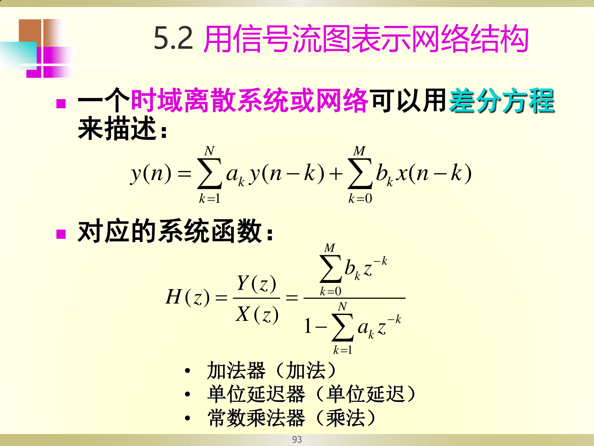

# 网络结构基本概念

## 【通俗理解】

前几章讨论的都是数学公式（$H(z)$、差分方程）。但真正要在硬件或程序中**实现**一个数字系统时，同一个 $H(z)$ 可以用不同的"电路接法"（网络结构）来搭建。不同的接法效果一样，但在精度、稳定性、计算量上有差异。

---

## 一、信号流图的三种基本元件

| 元件 | 符号 | 功能 |
|------|------|------|
| **加法器** | $\oplus$ | 将多路信号相加 |
| **单位延迟器** | $z^{-1}$ | 将信号延迟一个采样周期（存储一个值） |
| **常数乘法器** | $\times a$ | 将信号乘以常数 $a$ |

所有数字系统都可以用这三种元件搭建。

---

## 二、信号流图的基本概念

- **节点**：流图中的圆点，每个节点代表一个信号值
- **源节点**（输入节点）：$x(n)$，只有输出支路
- **吸收节点**（输出节点）：$y(n)$，只有输入支路
- **支路**：节点之间的有向连线，支路上标注增益（如 $z^{-1}$、$a$）
- **节点变量 = 所有输入支路的输出之和**

---

## 三、网络结构的两大分类

| 类型 | 特征 | 差分方程 | 脉冲响应 |
|------|------|---------|---------|
| **FIR** | 无反馈支路（无环路） | $y(n) = \sum_{m=0}^{M} b_m x(n-m)$ | 有限长 |
| **IIR** | 有反馈支路（有环路） | $y(n) = \sum_{k=1}^{N} a_k y(n-k) + \sum_{m=0}^{M} b_m x(n-m)$ | 无限长 |

> FIR 没有反馈（输出不会回头影响自己），所以天生稳定；IIR 有反馈，效率高但可能不稳定。

---

## 四、从 $H(z)$ 到网络结构

给定系统函数：

$$
H(z) = \frac{\sum_{k=0}^{M} b_k z^{-k}}{1 + \sum_{k=1}^{N} a_k z^{-k}}
$$

先写出差分方程，再用三种基本元件画出信号流图。**同一个 $H(z)$ 可以有多种不同的结构**（直接型、级联型、并联型等）。

---

## 【考卷标答模板】

**题型：由信号流图写差分方程和系统函数**

> 答题步骤：
> 1. 从流图中识别所有延迟器（$z^{-1}$）、乘法器（系数）和加法器
> 2. 按照信号流向写出差分方程：输出 = 前馈项 + 反馈项
> 3. 对差分方程取 Z 变换，整理得 $H(z) = Y(z)/X(z)$
