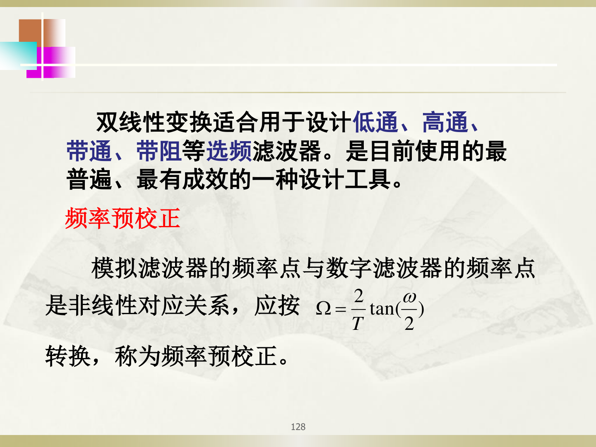
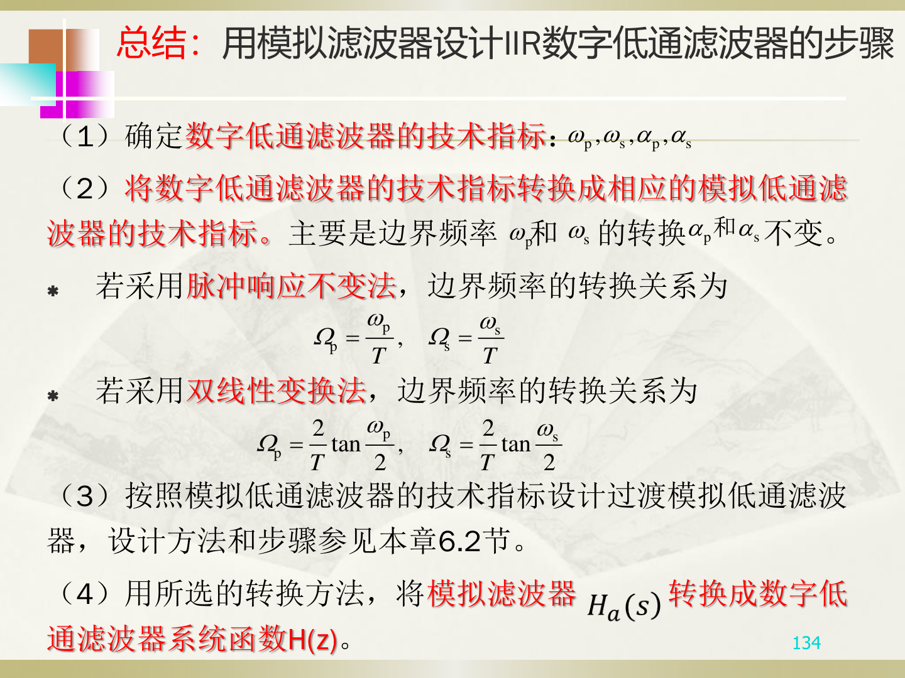

# 双线性变换法

## 【通俗理解】

双线性变换法用一个巧妙的数学映射，把整个 $s$ 平面"压缩"到 $z$ 平面，**彻底避免了频谱混叠**。代价是模拟频率和数字频率之间的关系变成了非线性的（要做"预畸变"校正）。

---

## 一、映射关系

$$
s = \frac{2}{T} \cdot \frac{1 - z^{-1}}{1 + z^{-1}}
$$

即：把 $H_a(s)$ 中所有的 $s$ 替换为 $\frac{2}{T} \cdot \frac{1-z^{-1}}{1+z^{-1}}$，就得到 $H(z)$。

$$
H(z) = H_a(s)\bigg|_{s = \frac{2}{T} \cdot \frac{1-z^{-1}}{1+z^{-1}}}
$$

---

## 二、频率对应关系（非线性！）

$$
\Omega = \frac{2}{T} \tan\left(\frac{\omega}{2}\right)
$$

这是一个**非线性**关系：$\omega$ 和 $\Omega$ 不是简单的正比，而是正切关系。

### 预畸变（Pre-warping）

设计数字滤波器时，先把数字频率指标 $\omega_p, \omega_s$ 通过上式转换为模拟频率指标 $\Omega_p, \Omega_s$：

$$
\Omega_p = \frac{2}{T}\tan\left(\frac{\omega_p}{2}\right), \quad \Omega_s = \frac{2}{T}\tan\left(\frac{\omega_s}{2}\right)
$$

然后用这些"预畸变"后的模拟指标去设计巴特沃斯滤波器，最后再用双线性变换映射回数字域。

> $\alpha_p, \alpha_s$ 不变，只有频率需要预畸变。

---

## 三、优缺点

| | 脉冲响应不变法 | 双线性变换法 |
|---|---|---|
| 频率关系 | 线性 $\omega = \Omega T$ | **非线性** $\Omega = \frac{2}{T}\tan(\omega/2)$ |
| 频谱混叠 | **有** | **无** |
| 适用范围 | 仅低通 | **低通/高通/带通/带阻** 都行 |
| 需要预畸变 | 不需要 | **需要** |
| 时域逼近 | 好 | 一般 |

---

## 四、用双线性变换法设计 IIR 数字低通滤波器的完整步骤

### 第1步：确定数字滤波器技术指标

$\omega_p, \omega_s, \alpha_p, \alpha_s$

### 第2步：预畸变——将数字频率转换为模拟频率

$$
\Omega_p = \frac{2}{T}\tan\left(\frac{\omega_p}{2}\right), \quad \Omega_s = \frac{2}{T}\tan\left(\frac{\omega_s}{2}\right)
$$

$\alpha_p, \alpha_s$ 保持不变。

### 第3步：设计巴特沃斯模拟低通滤波器 $H_a(s)$

按照巴特沃斯三步走：求 $N$ → 求 $\Omega_c$ → 查表得 $G_a(p)$ → 去归一化得 $H_a(s)$

### 第4步：双线性变换，将 $H_a(s)$ 转换为 $H(z)$

$$
H(z) = H_a(s)\bigg|_{s = \frac{2}{T} \cdot \frac{1-z^{-1}}{1+z^{-1}}}
$$

---

## 五、典型例题（复习PPT第130-132页）

**题目**：设计低通数字滤波器，技术指标为 $\omega_p = 0.2\pi$ rad，$\alpha_p = 1$ dB，$\omega_s = 0.3\pi$ rad，$\alpha_s = 15$ dB，$T = 1$s。用巴特沃斯低通滤波器+双线性变换法设计。

**解**：

**第1步：预畸变**

$$
\Omega_p = \frac{2}{1}\tan\left(\frac{0.2\pi}{2}\right) = 2\tan(0.1\pi) \approx 0.6498 \text{ rad/s}
$$

$$
\Omega_s = \frac{2}{1}\tan\left(\frac{0.3\pi}{2}\right) = 2\tan(0.15\pi) \approx 1.0190 \text{ rad/s}
$$

**第2步：设计巴特沃斯模拟低通滤波器**

用预畸变后的 $\Omega_p, \Omega_s$ 和 $\alpha_p = 1$dB, $\alpha_s = 15$dB 代入公式求 $N$：

$N \approx 5.31$，取 $N = 6$

求 $\Omega_c = 0.7663$ rad/s

查表得 $G_a(p)$，去归一化得 $H_a(s)$。

**第3步：双线性变换**

将 $s = \frac{2}{T}\frac{1-z^{-1}}{1+z^{-1}} = 2\frac{1-z^{-1}}{1+z^{-1}}$ 代入 $H_a(s)$，得到 $H(z)$：

$$
H(z) = \frac{0.0007378(1+z^{-1})^6}{(1-1.268z^{-1}+0.7051z^{-2})(1-1.010z^{-1}+0.358z^{-2})(1-0.9044z^{-1}+0.2155z^{-2})}
$$

（具体系数详见 PPT 第132页）

---

## 六、另一道简单例题（复习PPT第133页）

**题目**：模拟滤波器 $H_a(s) = \frac{1}{s^2+3s+2}$，用双线性变换法转换为数字滤波器，设 $T=2$s。

**解**：将 $s = \frac{2}{T}\frac{1-z^{-1}}{1+z^{-1}} = \frac{1-z^{-1}}{1+z^{-1}}$ 代入 $H_a(s)$：

$$
H(z) = H_a(s)\bigg|_{s=\frac{1-z^{-1}}{1+z^{-1}}} = \frac{1}{\left(\frac{1-z^{-1}}{1+z^{-1}}\right)^2 + 3\left(\frac{1-z^{-1}}{1+z^{-1}}\right) + 2}
$$

通分化简后得到：

$$
H(z) = \frac{(1+z^{-1})^2}{6 - 2z^{-2}} = \frac{1+2z^{-1}+z^{-2}}{6-2z^{-2}}
$$

---

## 【考卷标答模板】

**题型：用双线性变换法设计 IIR 数字滤波器**

> 答题步骤：
> 1. **预畸变**：$\Omega_p = \frac{2}{T}\tan(\omega_p/2)$，$\Omega_s = \frac{2}{T}\tan(\omega_s/2)$
> 2. **设计模拟滤波器**：用预畸变后的指标设计巴特沃斯 $H_a(s)$
> 3. **双线性变换**：$H(z) = H_a(s)|_{s=\frac{2}{T}\frac{1-z^{-1}}{1+z^{-1}}}$

**题型：填空——双线性变换法的优点**

> 避免了**频率响应的混叠**现象。

**题型：简答——两种方法的比较**

> 脉冲响应不变法的优点是模拟频率与数字频率线性对应，时域逼近好；缺点是存在频谱混叠。双线性变换法的优点是避免了频谱混叠；缺点是模拟频率与数字频率非线性对应，需要预畸变。
