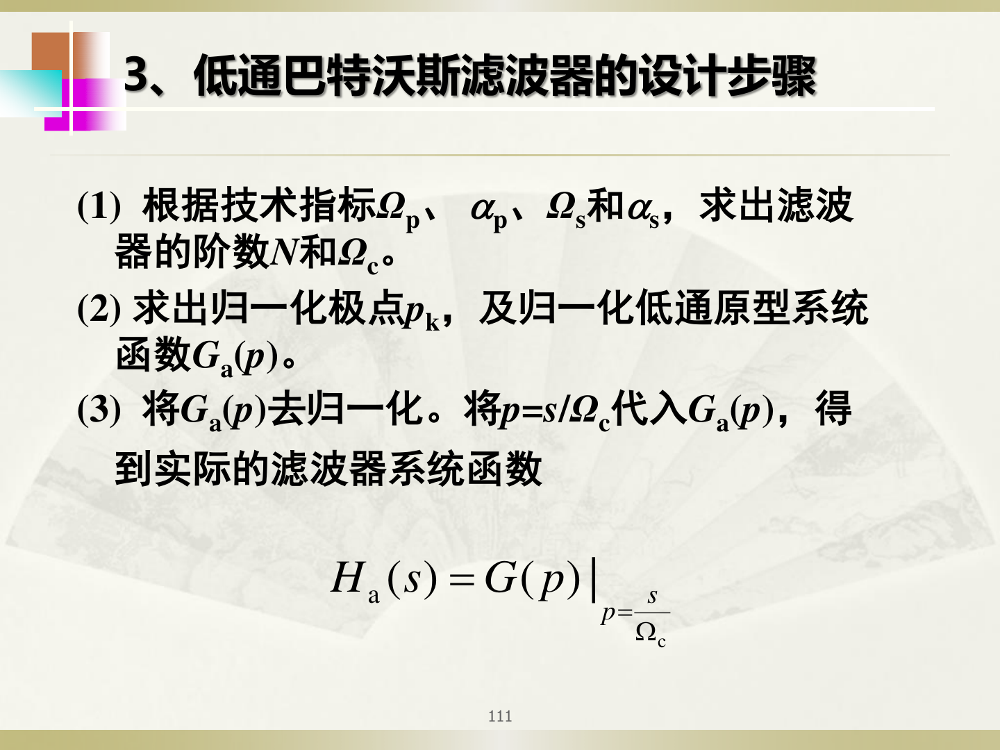
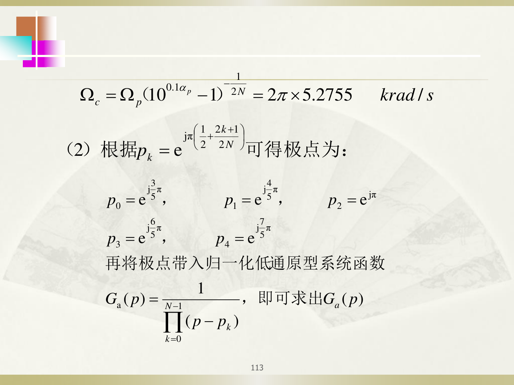
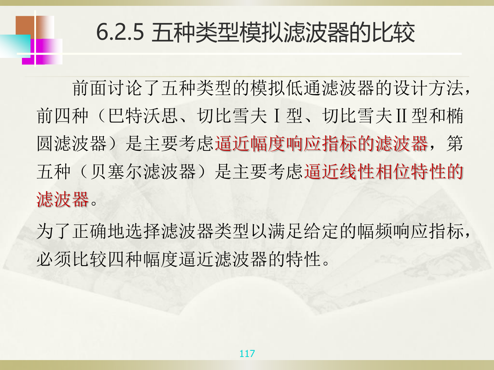
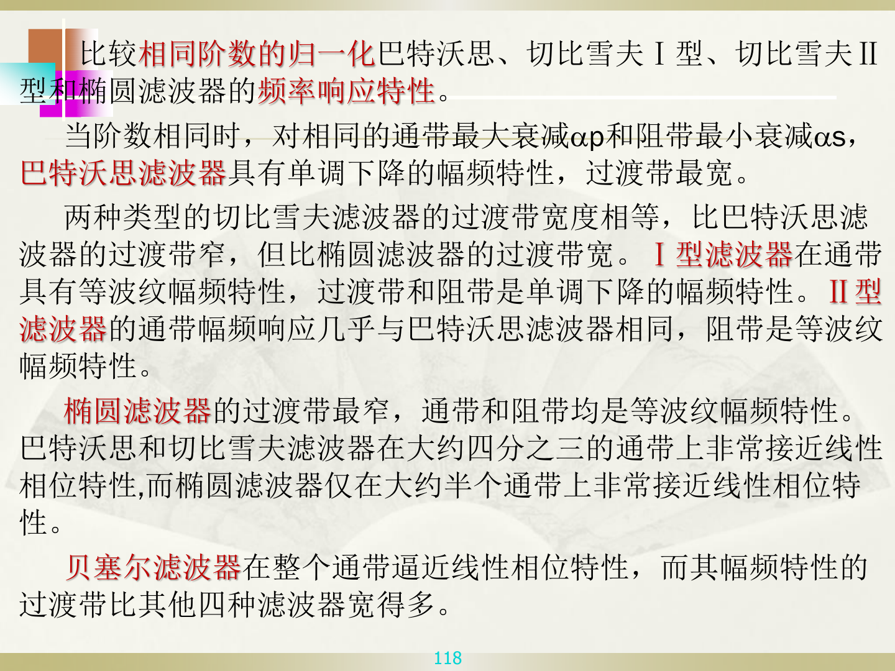

# 巴特沃斯滤波器设计

## 【通俗理解】

巴特沃斯滤波器是最"平滑"的滤波器——它在通带内的幅度响应最大限度地平坦（没有波纹），然后随频率增大单调下降。虽然它的过渡带不是最窄的，但设计最简单、最常考。

---

## 一、巴特沃斯滤波器的幅度平方函数

$$
\lvert H_a(j\Omega)\rvert^2 = \frac{1}{1 + \left(\frac{\Omega}{\Omega_c}\right)^{2N}}
$$

- $N$：滤波器阶数（$N$ 越大，过渡带越陡）
- $\Omega_c$：3dB 截止频率（幅度衰减到 $1/\sqrt{2}$ 即 $-3$dB 处的频率）

---

## 二、设计三步走（背住这个流程！）

### 第1步：由技术指标求阶数 $N$ 和 3dB 截止频率 $\Omega_c$

**求 $N$**（向上取整）：

$$
N \geq \frac{\lg\left(\frac{10^{0.1\alpha_s} - 1}{10^{0.1\alpha_p} - 1}\right)}{2\lg\left(\frac{\Omega_s}{\Omega_p}\right)}
$$

**求 $\Omega_c$**：

$$
\Omega_c = \frac{\Omega_p}{\left(10^{0.1\alpha_p} - 1\right)^{1/(2N)}}
$$

### 第2步：求归一化低通原型 $G_a(p)$

查表或用公式求 $N$ 阶巴特沃斯多项式的归一化极点 $p_k$：

$$
p_k = e^{j\pi\frac{2k+N-1}{2N}}, \quad k = 0, 1, \ldots, N-1
$$

取左半平面的极点（实部 < 0），构建归一化系统函数 $G_a(p)$。

**巴特沃斯归一化多项式表（根据 N 查）**：

| $N$ | $G_a(p) = 1 / B_N(p)$ 的分母多项式 $B_N(p)$ |
|-----|---------------------------------------------|
| 1 | $(p+1)$ |
| 2 | $(p^2 + 1.4142p + 1)$ |
| 3 | $(p+1)(p^2 + p + 1)$ |
| 4 | $(p^2 + 0.7654p + 1)(p^2 + 1.8478p + 1)$ |
| 5 | $(p+1)(p^2 + 0.6180p + 1)(p^2 + 1.6180p + 1)$ |
| 6 | $(p^2+0.5176p+1)(p^2+1.4142p+1)(p^2+1.9319p+1)$ |

> 算出 N 是几就查第几行，分子永远是 1。考试通常会给这张表或直接给 $G_a(p)$。

### 第3步：去归一化，得到实际 $H_a(s)$

令 $p = s/\Omega_c$，代入 $G_a(p)$：

$$
H_a(s) = G_a(p)\bigg|_{p = s/\Omega_c}
$$

**具体怎么做（以 $N=2$ 为例）**：

查表得 $G_a(p) = \frac{1}{p^2 + 1.4142p + 1}$

把每个 $p$ 替换成 $s/\Omega_c$：

$$H_a(s) = \frac{1}{\left(\frac{s}{\Omega_c}\right)^2 + 1.4142 \cdot \frac{s}{\Omega_c} + 1}$$

分子分母同乘 $\Omega_c^2$（通分）：

$$H_a(s) = \frac{\Omega_c^2}{s^2 + 1.4142\Omega_c \cdot s + \Omega_c^2}$$

> **就是换字母 + 通分**：$p \to s/\Omega_c$，然后乘掉分母里的分数。分子永远是 $\Omega_c^N$。

---

## 三、完整例题（复习PPT第112-115页）

**题目**：已知通带截止频率 $f_p = 5\text{kHz}$（$\Omega_p = 2\pi \times 5000 = 10000\pi$ rad/s），通带最大衰减 $\alpha_p = 2$dB，阻带截止频率 $f_s = 12\text{kHz}$（$\Omega_s = 2\pi \times 12000 = 24000\pi$ rad/s），阻带最小衰减 $\alpha_s = 30$dB。设计巴特沃斯低通滤波器。

**解**：

**第1步：求 $N$**

$$
N \geq \frac{\lg\left(\frac{10^{0.1 \times 30} - 1}{10^{0.1 \times 2} - 1}\right)}{2\lg\left(\frac{24000\pi}{10000\pi}\right)} = \frac{\lg\left(\frac{999}{0.5849}\right)}{2\lg(2.4)} \approx \frac{3.233}{0.760} \approx 4.25
$$

向上取整：$N = 5$

**第2步：求 $\Omega_c$**

$$
\Omega_c = \frac{\Omega_p}{(10^{0.1\alpha_p} - 1)^{1/(2N)}} = \frac{10000\pi}{(10^{0.2} - 1)^{1/10}} = \frac{10000\pi}{0.5849^{0.1}} \approx 10000\pi \times 1.055 \approx 5.2755 \text{krad/s}
$$

（对照 PPT 图片中的数值：$\Omega_c \approx 5.2755$ krad/s）

**第3步：求归一化极点并构建 $G_a(p)$**

$N=5$ 的归一化极点查表（或用公式）得到 5 个左半平面极点，构建 $G_a(p)$，再将 $p = s/\Omega_c$ 代入得到实际的 $H_a(s)$。

> 具体的极点数值和 $G_a(p)$ 表达式详见 PPT 图片 P113。考试中通常会给出查表结果或直接给 $G_a(p)$。

---

## 四、五种模拟滤波器的比较（了解）

| 滤波器类型 | 通带特性 | 过渡带宽度 | 阶数（同等指标） |
|-----------|---------|-----------|---------------|
| 巴特沃斯 | 最大平坦（无波纹） | 最宽 | 最高 |
| 切比雪夫I型 | 等波纹 | 中等 | 中等 |
| 切比雪夫II型 | 近似平坦 | 中等 | 中等 |
| 椭圆滤波器 | 等波纹 | **最窄** | **最低** |
| 贝塞尔滤波器 | 逼近线性相位 | 最宽 | — |

> 考试重点在巴特沃斯，其他类型了解即可。

---

## 【考卷标答模板】

**题型：设计巴特沃斯低通模拟滤波器**

> 答题步骤：
> 1. 由 $\alpha_p, \alpha_s, \Omega_p, \Omega_s$ 代入公式求 $N$（向上取整）
> 2. 代入公式求 $\Omega_c$
> 3. 查表得归一化 $G_a(p)$
> 4. 令 $p = s/\Omega_c$ 代入去归一化，得 $H_a(s)$
