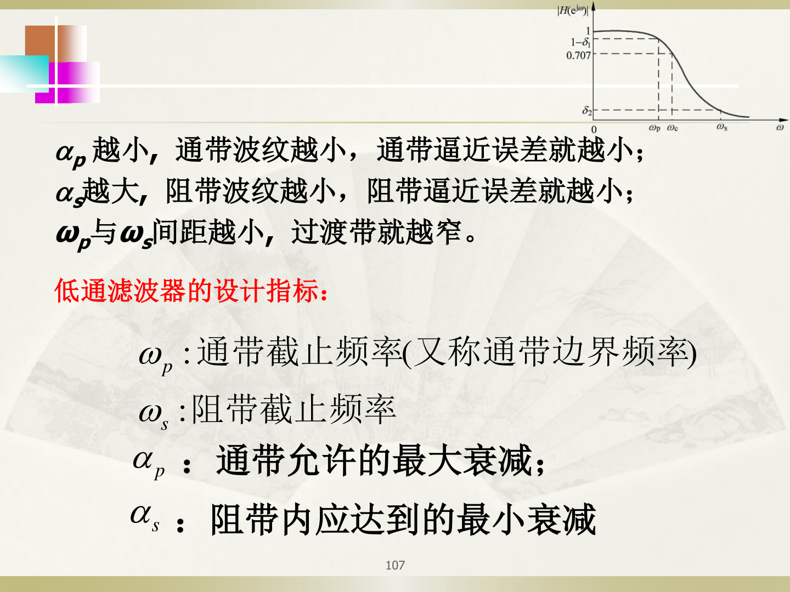

# 滤波器基本概念与技术指标

## 【通俗理解】

滤波器就是一个"频率筛子"——让想要的频率通过，把不想要的频率挡住。比如降噪耳机就是一个滤波器，把噪声（高频或特定频段）滤掉，只让音乐通过。

---

## 一、滤波器的分类

| 类型 | 英文 | 功能 |
|------|------|------|
| **低通**（LP） | Low-Pass | 让低频通过，挡住高频 |
| **高通**（HP） | High-Pass | 让高频通过，挡住低频 |
| **带通**（BP） | Band-Pass | 只让某个频带通过 |
| **带阻**（BS） | Band-Stop | 挡住某个频带，其余通过 |

---

## 二、低通滤波器的技术指标（核心考点）

对照上面 PPT 图片，低通滤波器有**四个关键参数**：

| 参数 | 符号 | 含义 |
|------|------|------|
| **通带截止频率** | $\omega_p$（数字）或 $\Omega_p$（模拟） | 通带的右边界，这个频率以下的信号要保留 |
| **阻带截止频率** | $\omega_s$（数字）或 $\Omega_s$（模拟） | 阻带的左边界，这个频率以上的信号要去掉 |
| **通带最大衰减** | $\alpha_p$（dB） | 通带内允许信号衰减多少（$\alpha_p$ 越小，通带越平） |
| **阻带最小衰减** | $\alpha_s$（dB） | 阻带内信号至少要衰减多少（$\alpha_s$ 越大，阻带滤得越干净） |

> $\omega_p$ 到 $\omega_s$ 之间的区域叫**过渡带**——这段频率"不管"，允许信号逐渐衰减。过渡带越窄，滤波器越"锐利"，但设计越难（需要更高阶数）。

---

## 三、IIR 数字滤波器的设计方法概述

IIR 滤波器主要用**间接法**设计：先设计一个模拟滤波器，再用某种映射方法转换为数字滤波器。

$$
\text{数字滤波器指标} \xrightarrow{\text{转换}} \text{模拟滤波器指标} \xrightarrow{\text{设计}} H_a(s) \xrightarrow{\text{映射}} H(z)
$$

两种映射方法：
1. **脉冲响应不变法**：$z = e^{sT}$（优点：时域逼近好；缺点：有频率混叠）
2. **双线性变换法**：$s = \frac{2}{T}\frac{1-z^{-1}}{1+z^{-1}}$（优点：无混叠；缺点：频率关系非线性）

模拟滤波器的设计最常考的是**巴特沃斯（Butterworth）**滤波器。

---

## 【考卷标答模板】

**题型：简答——低通滤波器的四个技术指标**

> 低通数字滤波器的技术指标包括：(1) 通带截止频率 $\omega_p$；(2) 阻带截止频率 $\omega_s$；(3) 通带最大衰减 $\alpha_p$（dB）；(4) 阻带最小衰减 $\alpha_s$（dB）。通带内幅度响应应大于 $1-\delta_1$，阻带内幅度响应应小于 $\delta_2$。
