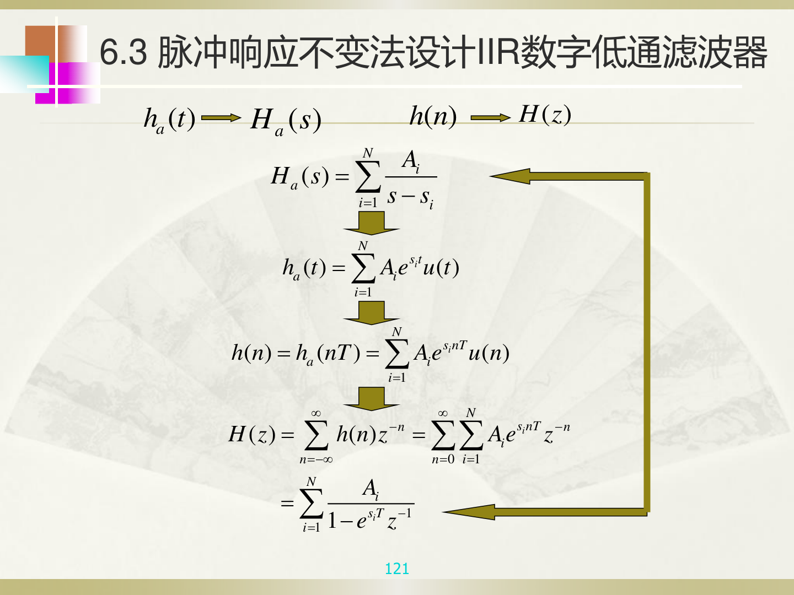

# 脉冲响应不变法

## 【通俗理解】

脉冲响应不变法的思路很直白：让数字滤波器的脉冲响应 $h(n)$ 就是模拟滤波器脉冲响应 $h_a(t)$ 在 $t = nT$ 处的采样值。即 $h(n) = h_a(nT)$。

---

## 一、映射关系

$$
z = e^{sT}
$$

模拟滤波器 $H_a(s)$ 先做部分分式展开：

$$
H_a(s) = \sum_{i=1}^{N} \frac{A_i}{s - s_i}
$$

每一项对应的时域是 $A_i e^{s_i t} u(t)$，采样后变成 $A_i e^{s_i nT} u(n)$，取 Z 变换：

$$
H(z) = \sum_{i=1}^{N} \frac{A_i}{1 - e^{s_i T} z^{-1}}
$$

> **核心操作**：对 $H_a(s)$ 的每个极点 $s_i$，直接用 $e^{s_i T}$ 替换为 Z 域极点。

---

## 二、优缺点

| | 优点 | 缺点 |
|---|---|---|
| **脉冲响应不变法** | 模拟频率 $\Omega$ 与数字频率 $\omega$ 是**线性关系** $\omega = \Omega T$，时域逼近好 | 存在**频谱混叠**（$s$ 平面的每条横带都映射到整个 $z$ 平面） |

> 频谱混叠的原因：采样频率不够高时，高频成分会"折叠"到低频，无法消除。

---

## 三、频率对应关系

$$
\omega = \Omega T \quad \text{（线性关系）}
$$

$$
\Omega_p = \omega_p / T, \quad \Omega_s = \omega_s / T
$$

指标转换时直接除以 $T$ 就行，不需要做任何非线性校正。

---

## 四、使用条件

只适用于**带限信号**（信号频谱不超过 $\pi/T$），否则混叠严重。因此主要用于设计**低通滤波器**。

---

## 【考卷标答模板】

**题型：简答——脉冲响应不变法的优缺点**

> **优点**：模拟频率与数字频率之间是线性关系 $\omega = \Omega T$，时域逼近好。
> **缺点**：存在频谱混叠现象，不适合设计高通和带阻滤波器。

**题型：用脉冲响应不变法求 $H(z)$**

> 答题步骤：
> 1. 将 $H_a(s)$ 展开为部分分式 $\sum \frac{A_i}{s - s_i}$
> 2. 每个极点 $s_i$ 用 $e^{s_i T}$ 替换：$\frac{A_i}{s-s_i} \to \frac{A_i}{1-e^{s_i T}z^{-1}}$
> 3. 将所有项相加得 $H(z)$
